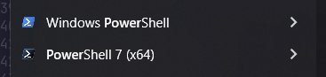
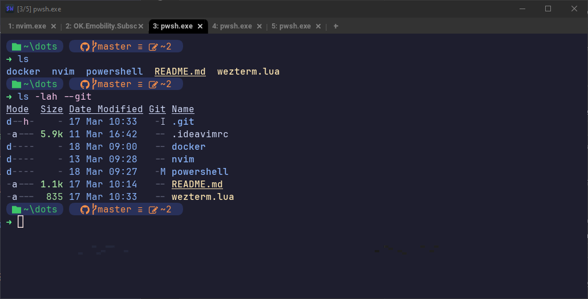
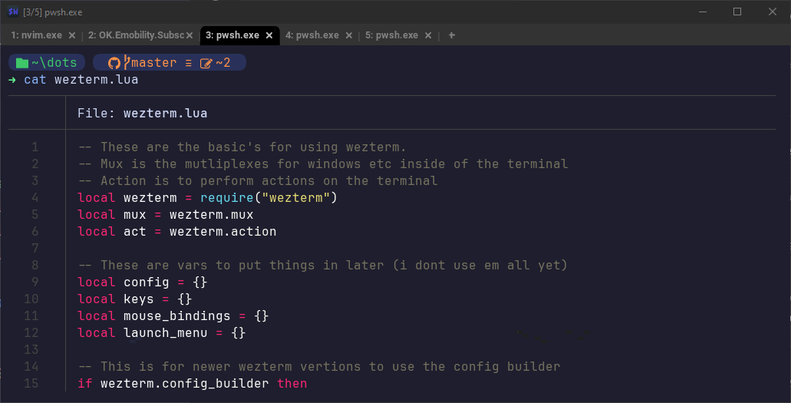
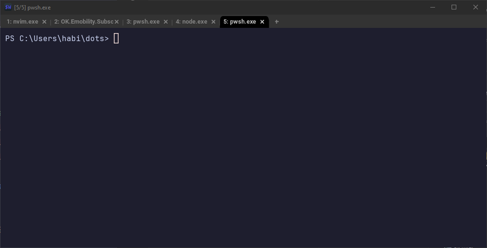
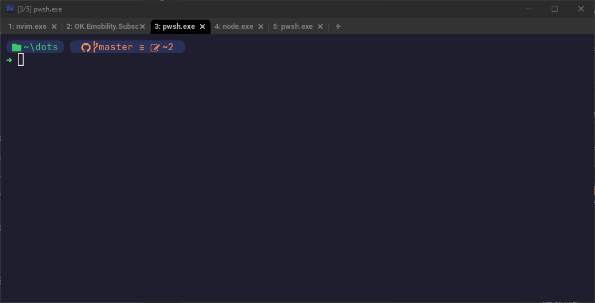
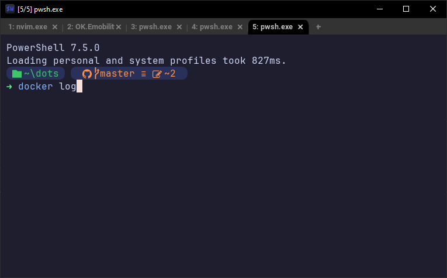
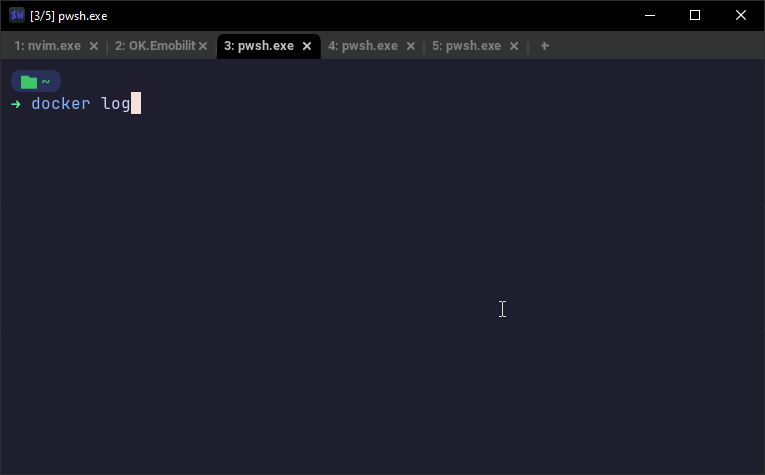

# PowerShell Survival Guide

_When work gives you lemons..._

## Versions



PowerShell comes in different versions, and some of the commands in this guide might not work in older versions. Some machines may only have the older version 5 installed (Windows PowerShell), while others come with both version 5 and version 7.

The newer versions of PowerShell are built on .NET Core and are supported on Linux as well.

**⚠️ If possible, always use the latest version ⚠️**

You can check your PowerShell version with the following command:

```ps1
$PSVersionTable.PSVersion
```

## Terminal Emulators

While you can use the default terminal emulator, there are certain advantages to using alternatives like [cmder](https://cmder.app/), [Wezterm](https://wezterm.org/), [Warp](https://www.warp.dev/), or the reliable [Windows Terminal](https://github.com/microsoft/terminal).

If you're unsure, Windows Terminal is a solid choice—it has all the features you'd expect from a modern emulator and is well-supported on Windows.

## Changing Settings

Most customization is done in PowerShell, but you may also need to tweak your emulator settings, such as keybindings, navigation, tabs, font, and color scheme.

Changing your PowerShell settings is typically done by modifying `$PROFILE`. Every time you open a new console, the contents of `$PROFILE` are executed.

The easiest way to edit these settings is by opening the profile in your editor of choice:

```ps1
code $PROFILE
```

or

```ps1
nvim $PROFILE
```

Changes will take effect in new shell sessions after saving the file. Existing shells will not reflect the changes.

If nothing else, you may want to improve the tab completion behavior. Add this line to `$PROFILE` to get an autocomplete experience similar to Linux and macOS:

```ps1
Set-PSReadlineKeyHandler -Key Tab -Function MenuComplete
```

# Tools

## [Eza](https://github.com/eza-community/eza)

_A modern replacement for `ls`_


Like `ls`, but better—supports tree views, Git status, and pretty colors 😍

#### Default PowerShell `ls`


#### With Eza



### [Install](https://github.com/eza-community/eza/blob/main/INSTALL.md#scoop-windows)

```ps1
winget install eza-community.eza
```

### Setup _(Optional)_

```ps1
Set-Alias ls -Value eza.exe -Option AllScope
```

## [Bat](https://github.com/sharkdp/bat)

_A `cat` clone with wings_

A `cat` alternative with syntax highlighting and Git integration.

#### Default PowerShell `cat`


#### With Bat



### [Install](https://github.com/sharkdp/bat?tab=readme-ov-file#with-winget)

```ps1
winget install sharkdp.bat
```

### Setup _(Optional)_

```ps1
Set-Alias cat -Value bat.exe -Option AllScope
```

## [Oh My Posh](https://ohmyposh.dev/)

_A prompt theme engine for any shell_

Customize your prompt with useful info like Git status and repo language, plus some pretty colors 🤩

#### Default PowerShell Prompt



#### PowerShell with Oh My Posh



### [Install](https://ohmyposh.dev/docs/installation/windows#installation)

```ps1
winget install JanDeDobbeleer.OhMyPosh -s winget
```

### [Setup](https://ohmyposh.dev/docs/installation/prompt)

Setting up Oh My Posh can be a bit involved. You may need to install a Nerd Font and configure your terminal emulator to use it for optimal results.

```ps1
oh-my-posh init pwsh | Invoke-Expression
```

#### With a [Theme](https://ohmyposh.dev/docs/themes)

```ps1
oh-my-posh init pwsh --config 'https://raw.githubusercontent.com/JanDeDobbeleer/oh-my-posh/refs/heads/main/themes/multiverse-neon.omp.json' | Invoke-Expression
```

## [Carapace](https://carapace.sh/)

_A multi-shell completion library and binary_

Command argument completion generator for [Cobra](https://github.com/spf13/cobra).

Provides autocompletion for tools like Docker, GitHub CLI, and [many others](https://carapace-sh.github.io/carapace-bin/completers.html).

#### Default PowerShell Autocomplete



#### PowerShell with Carapace



### [Install](https://carapace-sh.github.io/carapace-bin/install.html#winget)

```ps1
winget install -e --id rsteube.Carapace
```

### [Setup](https://carapace-sh.github.io/carapace-bin/setup.html#powershell)

Carapace may not work with PowerShell 5. It might also conflict with other PowerShell autocomplete handlers, and some colors may require tweaking for the best experience.

```ps1
carapace _carapace | Out-String | Invoke-Expression
```
